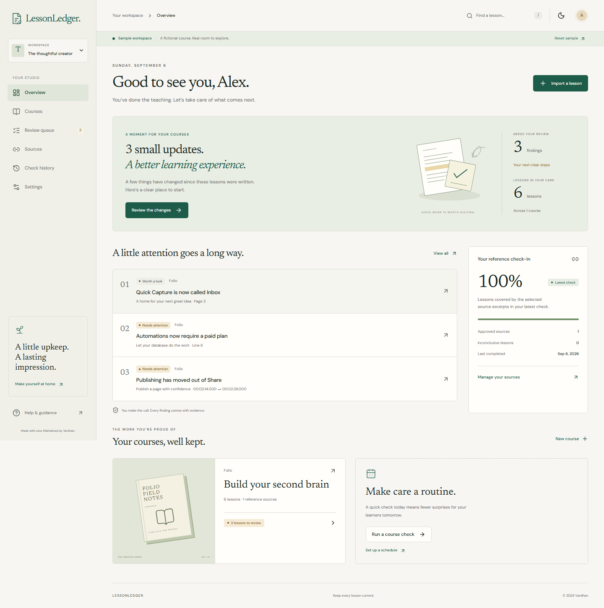
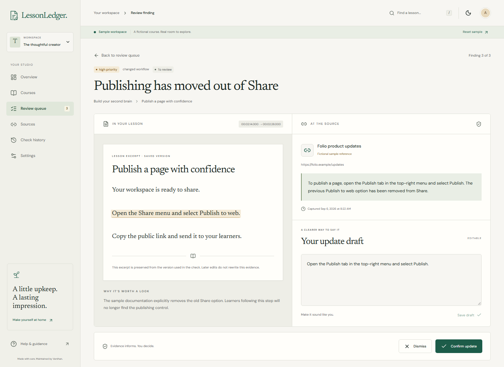
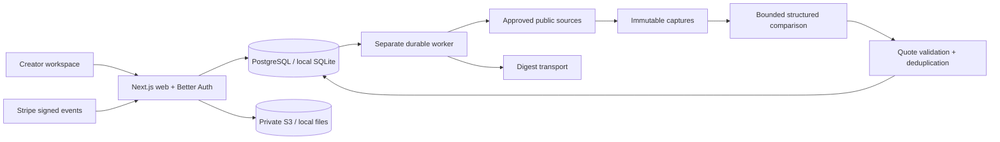

<p align="center"></p>

<p align="center"><strong>Created and maintained by Vardhan.</strong></p>

Software changes after a course is published. LessonLedger gives course creators a practical review routine: connect approved references, check saved lesson versions, compare exact evidence, and prepare precise updates. You make the final call.

<p align="center"><a href="#try-the-sample">Try the sample</a> · <a href="docs/setup.md">Configuration</a> · <a href="docs/architecture.md">Architecture</a> · <a href="docs/launch-checklist.md">Release status</a></p>

## A clearer place to start



An isolated **Sample workspace** contains an original fictional Folio course, six lessons, three known changes, and unchanged instructions. Sample references are fictional and labeled accordingly. Reviews persist within the disposable session; no payment or external provider key is needed.

## Evidence, right where you need it



- **Bring your lessons.** Preview pasted text, TXT, Markdown, SRT, VTT, and text-based PDF. Keep subtitle timestamps, line markers, and PDF page numbers.
- **Choose trusted references.** Approve public documentation URLs or authorized manual text captures. Preserve the source and capture date.
- **Check with a durable worker.** Queue checks, follow real progress, cancel work, and recover expired worker leases. Coverage and unavailable sources remain visible.
- **Review deliberately.** Confirm, dismiss, resolve, or reopen findings. Edit drafts and retain an audit history. Applying a draft creates a new version and queues a recheck.
- **Take the work with you.** Export confirmed findings as Markdown, CSV, or PDF. Export complete workspace records as JSON.
- **Build a routine.** Configure monitoring intervals, notification preferences, retention, and server-enforced subscription allowances.

The live adapters are implemented for PostgreSQL, private S3-compatible storage, passwordless email, structured comparisons, and Stripe subscriptions. **External provider verification and deployment remain release gates.** See the [launch checklist](docs/launch-checklist.md); local fixture tests do not validate live providers.

## Try the sample

Use a current Node.js 22 or 24 LTS release and pnpm 10.30.3. The local sample uses SQLite and private local files; Docker is optional.

```sh
corepack enable
corepack prepare pnpm@10.30.3 --activate
pnpm install --frozen-lockfile
pnpm dev
```

Open **http://localhost:3000** and choose **Explore the sample**. `pnpm dev` applies migrations and starts both the web application and the separate worker. Use `localhost` consistently, since request origins are checked. No `.env` file is needed for the local sample. Each browser receives an independent sample that expires after 24 hours.

To exercise actual passwordless sign-in locally, open Sign in. The development email adapter writes the message into `data/mail/`; follow its link. Those files contain private sign-in tokens and are ignored by Git. An authenticated account starts with an empty workspace; sample data is never inserted into it.

For a local production build, explicitly set `DEMO_MODE=true` when starting both processes. Production otherwise disables sample mode. See [setup](docs/setup.md) for PowerShell commands, live services, and failure behavior.

## How it fits together



Read [architecture and data flow](docs/architecture.md), [deployment and rollback](docs/deployment.md), [security](SECURITY.md), and [evaluation methodology](docs/evaluation.md).

## Verification

```sh
pnpm db:migrate
pnpm db:seed
pnpm lint
pnpm typecheck
pnpm test
pnpm build
pnpm exec playwright install chromium
pnpm test:e2e
pnpm backup:verify
```

`pnpm verify` runs lint, type checking, service tests, production build, and browser acceptance tests. Browser tests cover the sample workflow, real library sign-in through the local inbox, tenant isolation, stored hostile content, keyboard dialogs, responsive layouts, and automated accessibility scans. The workflow in `.github/workflows/verify.yml` also defines PostgreSQL testing and a disposable restore check; its remote result is only known after the repository is pushed and CI runs.

Capture the actual running sample with `pnpm screenshots`. The screenshots above come from the application, not design mockups. [Verification details](docs/verification.md) distinguish results that ran locally from pending release checks.

## Scope and limits

| Input / work                         | Limit                                                                   |
| ------------------------------------ | ----------------------------------------------------------------------- |
| TXT, Markdown, SRT, VTT, pasted text | UTF-8; 180,000 normalized characters; 300 segments                      |
| Text-based PDF                       | 5 MB; 80 pages; no OCR                                                  |
| Each upload                          | One file; 5 MB; bounded parser process                                  |
| Each course check                    | 25 lessons; 8 approved sources; 20 comparison calls maximum             |
| Each comparison                      | 10,000 lesson characters; 16,000 source characters; 2,400 output tokens |
| Live check budget                    | $2 reserved upper bound, using operator-verified token prices           |

Checks identify **potential** outdated material. They neither certify correctness nor guarantee exhaustive detection. Unchanged wording, different software versions, and ambiguous references require care. Truncated or inconclusive coverage is reported. Live quality evaluation on a human-reviewed corpus is required before customer launch.

Starter ($49/month) and Studio ($129/month) are experimental pricing hypotheses. Manual and scheduled checks share a UTC calendar-month allowance; retries retain their original reservation. No unlimited processing is promised. SMTP delivery can be ambiguous after a transport failure; uncertain digests require operator review rather than automatic duplicate delivery.

## What comes next

The launch work is provider verification, PostgreSQL/container validation, human-reviewed comparison evaluation, an exercised production backup policy, and finalized privacy details. Future product work may include richer product/version mapping and expanded source registries. Video transcription, OCR, authenticated crawling, automatic video edits, and team invitations are outside v1.

## Maintainer and licensing

Created and maintained by **Vardhan**. Copyright © 2026 Vardhan. The project lives at [grammerpro/LessonLedger](https://github.com/grammerpro/LessonLedger). No open-source license has been selected; rights remain with Vardhan. Dependency and font licenses are retained separately in [third-party notices](docs/third-party-notices.md). A private security contact has not yet been supplied.
